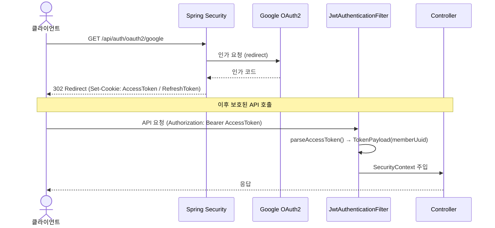
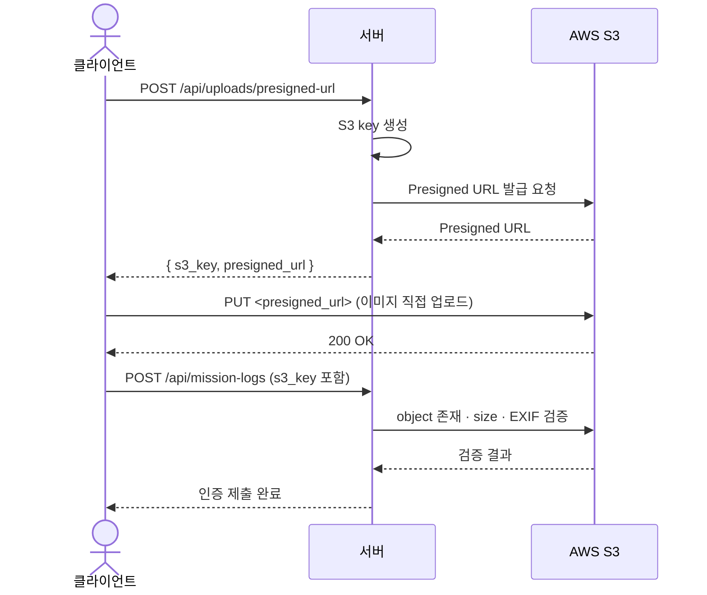

# 🤝 Dondok (돈독) — Backend
> **함께 채우는 성실함의 가치, 지분 기반 습관 형성 플랫폼** <br/>
> Spring Boot 기반 RESTful API 서버

<p align="center">
  
<br/>
  <strong>Dondok</strong>
<br/>
</p>


## 서비스 소개

**돈독**은 "함께 해야 더 오래 지속된다"는 믿음에서 시작한 **지분 기반 습관 형성 플랫폼**입니다.

혼자 하는 목표 달성은 작심삼일로 끝나기 쉽습니다. 돈독은 **보증금(deposit) + 지분율**이라는 금전적 장치를 통해 서로가 서로의 동기를 유지시켜 주는 구조를 만들었습니다.

### 핵심 메커니즘

```
크루원 전원이 보증금을 예치 → 매일 미션 인증 → 완료율에 비례하여 환급
```

성실하게 참여한 크루원은 나태한 크루원의 지분을 가져갑니다. 습관 유지에 실패하면 보증금 일부를 잃고, 성공하면 오히려 더 돌려받을 수 있습니다.

---

### 주요 기능

#### 크루 (Crew)
- 카테고리·일정·보증금 조건으로 습관 크루를 생성하고 참여자를 모집합니다.
- 방장이 신청을 승인하면 보증금이 확정 예치되고 미션이 시작됩니다.
- 모집 인원 미달 시 자동 폐쇄, 진행 기간 종료 시 자동 `CLOSED` 전환이 이루어집니다.

#### 미션 인증
- 크루원은 매일 사진을 촬영해 인증을 제출합니다.
- 서버는 **EXIF 메타데이터** 기반으로 촬영 시각·위조 여부를 자동 검증하고, 방장이 수동 승인·거절로 최종 판정합니다.
- 일정 시간이 지나면 미처리 인증은 **자동 승인**되어 크루 운영이 원활하게 유지됩니다.

#### 정산 (Settlement)
- 크루 타입(A/B/C)에 따라 하루 1회 **일일 정산 스냅샷**이 생성됩니다.
- 크루 종료 시 각 참여자의 미션 완료율을 기반으로 **지분율(share ratio)**을 산정하고 환급금을 분배합니다.
- 정산 실패 시 30분 간격 자동 재시도로 데이터 유실을 방지합니다.

#### 도딘 지갑 (Point Wallet)
- Toss Payments 연동 충전 및 **포인트 원장(append-only)** 관리로 모든 입출금 이력을 추적합니다.
- 보증금 예치·환급·충전 복구가 모두 동일 트랜잭션 내에서 처리되어 잔액 무결성을 보장합니다.

#### 피드 & 소통
- 같은 크루원의 인증 사진을 피드 형태로 확인하고 이모지 리액션으로 응원할 수 있습니다.
- 방장은 공지사항을 작성하고 크루원은 댓글·리액션으로 소통합니다.

#### AI 크루 생성 도우미
- **OpenAI GPT-4.1 mini** 기반으로 크루 제목·설명·미션 조건 추천을 제공합니다.

#### 알림
- FCM 푸시(Firebase)와 AWS SES 이메일로 정산 완료·미검토 인증·크루 종료 예정 등 핵심 이벤트를 전달합니다.
- 방해금지 시간대 필터링을 지원합니다.

---

### 크루 상태 흐름

```
RECRUITING ──(모집 기간 종료·최소 인원 충족)──▶ ACTIVE ──▶ CLOSED
RECRUITING ──(모집 기간 종료·최소 인원 미달)──▶ CANCELLED
```

### 정산 흐름

```
[매일] 일일 정산 스냅샷 생성
        │
        ▼ (크루 종료)
[최종 정산 배치]
  참여자별 미션 완료율 → 지분율 산정 → 환급금 계산 → 포인트 원장 기록
```

---

## 기술 스택

| 분류 | 기술 |
|------|------|
| Language | Java 17 |
| Framework | Spring Boot 3.2.12 |
| Auth | Spring Security + JJWT 0.12.7 (Access 30분 / Refresh 7일) + Google OAuth2 |
| ORM | Spring Data JPA (Hibernate) + QueryDSL 5.1.0 |
| Batch | Spring Batch 5.x (일일·최종 정산, 크루 상태 전환, 알림 스케줄링) |
| DB | MySQL 8.0 (AWS RDS) + Flyway (DB 마이그레이션) |
| Cache | Caffeine (JVM 인메모리) |
| Storage | AWS S3 (awspring 3.1.1) + Presigned URL 직접 업로드 |
| Notification | Firebase Admin SDK 9.9.0 (FCM 푸시) + AWS SES (이메일) |
| AI | OpenAI GPT-4.1 mini (크루 생성 도우미) |
| Infra | AWS EC2 (Ubuntu 24.04) + Docker (Blue/Green 무중단 배포) + Nginx |
| CI/CD | GitHub Actions |
| Monitoring | Spring Actuator + Micrometer Prometheus + Grafana |
| API Docs | SpringDoc OpenAPI 2.8.17 (Swagger UI) |
| Test | JUnit5 + Testcontainers (MySQL/LocalStack) + H2 + ArchUnit 1.4.2 |
| Code Quality | Spotless + Google Java Format + Checkstyle 10.26.1 + OWASP Dependency Check |

---

## 패키지 구조

```
src/main/java/com/oit/dondok/
│
├── DondokApplication.java
│
├── config/                           # OpenAPI, QueryDSL 전역 설정
│
├── domain/                           # 도메인별 레이어드 구조
│   ├── auth/                         # 인증 (OAuth2 소셜 로그인, Refresh Token 관리)
│   │   ├── controller/
│   │   ├── dto/
│   │   │   ├── request/
│   │   │   └── response/
│   │   ├── entity/
│   │   ├── repository/
│   │   ├── service/
│   │   ├── exception/
│   │   ├── code/
│   │   └── constant/
│   │
│   ├── crew/                         # 크루 생성·조회·참여·상태 전환
│   │   ├── controller/
│   │   ├── dto/
│   │   │   ├── request/
│   │   │   └── response/
│   │   ├── entity/
│   │   ├── repository/
│   │   ├── service/
│   │   ├── exception/
│   │   ├── port/                     # 외부 서비스 연동 인터페이스
│   │   └── scheduler/                # 크루 상태 전환 배치 스케줄러
│   │
│   ├── dashboard/                    # 개인 대시보드 통계 조회
│   │   ├── controller/
│   │   ├── dto/
│   │   │   └── response/
│   │   ├── repository/
│   │   ├── service/
│   │   └── port/
│   │
│   ├── image/                        # 이미지 메타데이터 (S3 key 관리)
│   │   ├── entity/
│   │   ├── repository/
│   │   └── port/
│   │
│   ├── member/                       # 회원 프로필 조회·수정
│   │   ├── controller/
│   │   ├── dto/
│   │   │   ├── request/
│   │   │   └── response/
│   │   ├── entity/
│   │   ├── repository/
│   │   ├── service/
│   │   └── exception/
│   │
│   ├── mission/                      # 미션 인증 제출·검토·자동 인증
│   │   ├── controller/
│   │   ├── dto/
│   │   │   ├── request/
│   │   │   └── response/
│   │   ├── entity/
│   │   ├── repository/
│   │   ├── service/
│   │   ├── exception/
│   │   └── port/
│   │
│   ├── notification/                 # FCM 푸시 알림 발송·조회
│   │   ├── controller/
│   │   ├── dto/
│   │   │   ├── request/
│   │   │   └── response/
│   │   ├── entity/
│   │   ├── repository/
│   │   ├── service/
│   │   ├── exception/
│   │   └── port/
│   │
│   ├── point/                        # 포인트 충전·잔액·원장
│   │   ├── controller/
│   │   ├── dto/
│   │   │   ├── request/
│   │   │   └── response/
│   │   ├── entity/
│   │   ├── repository/
│   │   ├── service/
│   │   ├── exception/
│   │   ├── port/
│   │   └── scheduler/                # 충전 복구 배치 스케줄러
│   │
│   └── settlement/                   # 일일·최종 정산 배치 및 조회
│       ├── controller/
│       ├── dto/
│       │   └── response/
│       ├── entity/
│       │   ├── converter/
│       │   └── parser/
│       ├── repository/
│       ├── service/
│       │   └── model/
│       └── scheduler/                # 정산 배치 스케줄러
│
├── global/                           # 전역 공통
│   ├── config/                       # 전역 Bean 설정
│   ├── entity/                       # BaseEntity (생성/수정 시각)
│   ├── exception/                    # GlobalExceptionHandler, ErrorResponse
│   │   └── dto/
│   │       └── response/
│   ├── health/                       # S3 · Redis Actuator 헬스 인디케이터
│   │   └── controller/
│   ├── util/                         # 공통 유틸리티
│   └── validation/                   # 커스텀 Bean Validation
│
└── infra/                            # 외부 인프라 연동
    ├── ai/                           # OpenAI GPT-4.1 mini 어댑터
    │   ├── adapter/
    │   └── config/
    ├── auth/                         # Spring Security · JWT · OAuth2
    │   ├── config/
    │   ├── exception/
    │   ├── filter/
    │   ├── handler/
    │   ├── oauth2/
    │   └── token/
    ├── fcm/                          # Firebase FCM 어댑터 · 이벤트
    │   ├── adapter/
    │   ├── config/
    │   └── event/
    ├── image/                        # 이미지 업로드 파이프라인 (Presigned URL · 리인코딩)
    │   ├── adapter/
    │   ├── controller/
    │   ├── dto/
    │   ├── event/
    │   ├── exception/
    │   └── service/
    ├── payment/                      # 결제 연동
    ├── s3/                           # AWS S3 어댑터 (storage · delivery)
    └── ses/                          # AWS SES 이메일 어댑터
        ├── adapter/
        ├── config/
        └── template/
```

---

## 아키텍처 개요

### 인증 흐름



- Access Token (30분) / Refresh Token (7일, DB hash 저장 · Rotation 정책)
- 외부 API 식별자는 `member_uuid` (UUID), 내부 PK(`member.id`)는 노출 금지

### 이미지 업로드 흐름



### 배치 스케줄

| 주기 | 시각 (KST) | 작업 |
|------|-----------|------|
| 매일 | 00:00 | 크루 일일 배치 — 신청 자동 만료(PENDING→EXPIRED), 크루 활성화(RECRUITING→ACTIVE), 크루 종료(ACTIVE→CLOSED), 종료 D-3 알림 |
| 매일 | 00:00 | Type B 일일 정산 스냅샷 |
| 매일 | 00:10 | Type B 최종 정산 |
| 매일 | 12:00 | Type A 일일 정산 스냅샷 |
| 매일 | 12:05 | Type C 일일 정산 스냅샷 |
| 매일 | 12:10 | Type A 최종 정산 |
| 매일 | 12:20 | Type C 최종 정산 |
| 매 3분 | — | 미션 자동 인증 처리 (PENDING → APPROVED) |
| 매 5분 | — | 포인트 충전 복구 배치 |
| 매 30분 | — | 최종 정산 재시도 (실패 건) |
| 매 30분 | — | 일일 정산 스냅샷 재시도 (실패 건) |

---

## CI/CD 파이프라인

### CI (`ci.yml`) — PR / main 푸시 시 자동 실행

| 단계 | 내용 |
|------|------|
| Quality Gate | `spotlessCheck` + `checkstyleMain/Test` + `test` |
| Secret Scan | gitleaks 8.30.1 — 하드코딩 시크릿 탐지 |
| OWASP | Dependency Check — CVE 7.0 이상 빌드 차단 |

### CD (`cd-backend.yml`) — main CI 성공 후 자동 배포

```
[GitHub Actions]
    │ Dockerfile build → Docker Hub push
    │
    ▼
[AWS EC2]
    │ 현재 Blue/Green 확인
    │ 새 컨테이너 기동 → Healthcheck 통과
    │ Nginx upstream 전환
    └ 구 컨테이너 종료
```

- 동시 배포 방지: `concurrency: backend-prod-deploy` (cancel-in-progress: false)
- 수동 배포: `workflow_dispatch` 트리거 지원

---

## 로컬 개발 환경

### 요구사항
- Java 17+
- Docker Desktop

### 실행 방법

**macOS / Linux / Windows Git Bash**

```bash
# 1. 환경 변수 설정
cp .env.example .env

# 2. 로컬 인프라 실행 (MySQL, Redis, LocalStack)
docker compose up -d

# 3. 애플리케이션 실행
./gradlew bootRun --args='--spring.profiles.active=local'
```

**Windows PowerShell**

```powershell
# 1. 환경 변수 설정
copy .env.example .env

# 2. 로컬 인프라 실행 (MySQL, Redis, LocalStack)
docker compose up -d

# 3. 애플리케이션 실행
.\gradlew.bat bootRun --args='--spring.profiles.active=local'
```

> **Git hook 설정 필수** — 첫 커밋 전 반드시 [CONTRIBUTING.md](./CONTRIBUTING.md) 섹션 5를 완료하세요.
> (pre-commit 훅 미설치 시 Spotless · gitleaks 검사 없이 커밋됩니다.)

### 환경 변수 (.env)

```env
MYSQL_URL=jdbc:mysql://localhost:3306/dondok
MYSQL_USER=dondok
MYSQL_PASSWORD=dondok
REDIS_HOST=localhost
REDIS_PORT=6379
JWT_SECRET=...
AWS_ACCESS_KEY_ID=...
AWS_SECRET_ACCESS_KEY=...
AWS_REGION=ap-northeast-2
AWS_S3_BUCKET=...
GOOGLE_OAUTH_CLIENT_ID=...
GOOGLE_OAUTH_CLIENT_SECRET=...
OPENAI_API_KEY=...
FIREBASE_CREDENTIALS_PATH=...
```

### 빌드 / 테스트

```bash
# 포맷 자동 적용 (코드 수정 후 build 전에 실행)
./gradlew spotlessApply --no-daemon

# 전체 빌드 (Spotless 포맷 검사 + Checkstyle + 테스트 포함)
./gradlew build --no-daemon

# 테스트만 실행
./gradlew test --no-daemon

# 단일 테스트 클래스 실행
./gradlew test --no-daemon --tests "com.oit.dondok.domain.member.service.MemberServiceTest"

# Flyway 마이그레이션 검증 (Testcontainers 필요)
./gradlew flywayValidationTest --no-daemon
```

> 코드 수정 후 항상 `spotlessApply` → `build` 순서로 실행한다.

---

## API 문서

| 환경 | URL |
|------|-----|
| 로컬 | http://localhost:8080/swagger-ui/index.html |
| 운영 (EC2) | http://43.203.87.248/swagger-ui/index.html |

---

## Git 전략

| 브랜치 | 용도 |
|--------|------|
| `main` | 프로덕션 배포 |
| `feat/{이슈번호}-{기능명}` | 기능 개발 |
| `hotfix` | 긴급 버그 수정 |

- PR 머지: 최소 1명 코드 리뷰 승인 후 **Merge**
- 커밋 컨벤션: `feat` / `fix` / `refactor` / `docs` / `test` / `chore`

---

## 팀원 및 담당

### 👩‍💻 김세희 — PM · Backend Engineer

프로젝트 전반 일정 관리와 백엔드 도메인 개발을 담당하며, 미션 검증·대시보드·피드 시스템 및 API 표준화를 주도했습니다.

| 영역 | 내용 |
|------|------|
| 프로젝트 관리 | 일정 관리 및 태스크 분배, API 명세 및 개발 프로세스 정합성 관리 |
| 미션 검증 · 이미지 처리 | EXIF 기반 자동 검증 로직, S3 연동 및 인증 이미지 비동기 재인코딩 파이프라인 설계, 이미지 크기·포맷 제한 정책 |
| 대시보드 · 통계 | 크루 진행률·손익·순위 집계 API, Projection 기반 조회 최적화 |
| 피드 · 상호작용 | 인증 피드 조회 API, 피드·미션 로그 리액션 동시성 처리, 정렬 로직 및 응답 구조 개선 |
| 문서화 · 개발 환경 | API 명세 표준 정립, CodeRabbit·GitHub 템플릿 등 협업 환경 구축 |

---

### 👨‍💻 서일현 — Backend Lead

정산, 결제, 포인트 원장 등 핵심 비즈니스 도메인을 설계하고 대규모 데이터 처리 구조를 구축했습니다.

| 영역 | 내용 |
|------|------|
| 도딘 지갑 · 결제 | 포인트 원장 시스템 설계, Toss Payments 샌드박스 연동, 결제 복구 스케줄러(Sweeper) 구현 |
| 정산 시스템 | 일일 정산 스냅샷 생성, 최종 정산 배치 개발, Retry 및 Backfill 로직 구현 |
| 회원 프로필 | 프로필 조회·수정 API, Profile Image URL Resolver 구현 |
| 기반 아키텍처 | JPA Auditing, Base Entity 설계, ArchUnit·Checkstyle 도입, 취약 의존성(CVE) 대응 |

---

### 👨‍💻 문창현 — Infrastructure & DevOps Lead

인증·보안 시스템과 배포 인프라를 구축하여 서비스 운영 기반을 마련했습니다.

| 영역 | 내용 |
|------|------|
| 인증 · 보안 | Spring Security 기반 JWT 인증 체계, Refresh Token 재발급·로그아웃, Google OAuth2 로그인, 일반 회원가입 |
| AWS · 인프라 | EC2 서버 구축·운영, RDS(MySQL) 환경 구성, S3 버킷·IAM 관리, Route53 도메인·HTTPS 인증서 설정 |
| CI/CD · 운영 | Blue/Green 무중단 배포 파이프라인, GitHub Actions 자동 배포, Grafana 모니터링 환경 구성 |
| 시스템 안정성 | 전역 예외 처리 구조 설계, 에러 코드 체계화, 로그 수집 및 장애 대응 환경 정비 |

---

### 👩‍💻 김한비 — QA & Notification Engineer

알림 인프라 구축과 운영 콘솔 개발, 품질 검증 프로세스를 담당했습니다.

| 영역 | 내용 |
|------|------|
| 알림 시스템 | FCM 기반 디바이스 푸시 알림 구축, AWS SES 이메일 발송 인프라, 알림 배지·알림 페이지 구현 |
| 알림 스케줄링 | 정산 완료·미검토 인증·크루 종료 예정·댓글·리액션 알림, 방해금지 시간 필터링 |
| 운영 콘솔 | 입장 신청 승인·거절 API, 미검토 신청 자동 거절 스케줄러, 크루 해체, 인증 되돌리기(Revert) |
| 크루 소통 | 공지사항 CRUD, 댓글 및 공지 리액션 API |
| 품질 관리 | 기능 검증 및 시나리오 테스트, UI 시안과 구현 결과 정합성 점검 |

---

### 👨‍💻 전성 — Frontend Lead · Crew Domain Backend

서비스의 UI/UX 설계와 PWA 환경 구축, 핵심 화면 개발 및 크루 도메인 백엔드 개발을 담당했습니다.

| 영역 | 내용 |
|------|------|
| 디자인 시스템 | 모달·칩·드롭다운·하단 네비게이션 등 공통 컴포넌트 설계, 디자인 일관성 및 재사용 구조 구축 |
| 핵심 페이지 개발 | 크루 대시보드·도딘 지갑·미션 인증·피드·내/타인 프로필 UI, 동적 차트 애니메이션 |
| PWA · 배포 | PWA 초기 설정·서비스 워커, HEIC 이미지 변환, Vercel 프론트엔드 배포 파이프라인 구축 |
| 크루 도메인 백엔드 | 크루 생성·상세·목록 API, 입장 신청·철회, AI 크루 생성 도우미 연동, 미션 인증 로그 상세 조회 |
| 배치 자동화 | 인원 미달 크루 자동 폐쇄, 크루 자동 활성화, 미션 종료일 기준 CLOSED 전환 스케줄러 |

---

## 관련 문서

- [API 명세서](./docs/api/)
- [코드 컨벤션](./docs/convention/code-convention.md)
- [Git 컨벤션](./docs/convention/git-convention.md)
- 시스템 아키텍처 — 이미지 추가 예정
- ERD — 이미지 추가 예정
- 유즈케이스 다이어그램 — 이미지 추가 예정


